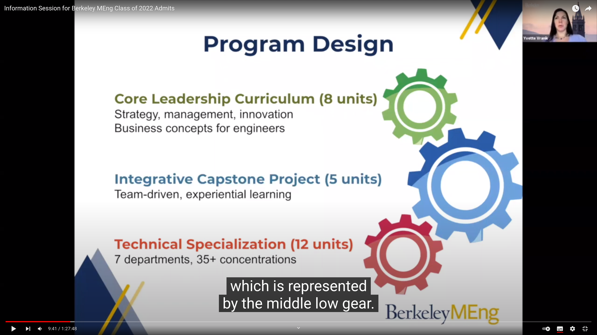
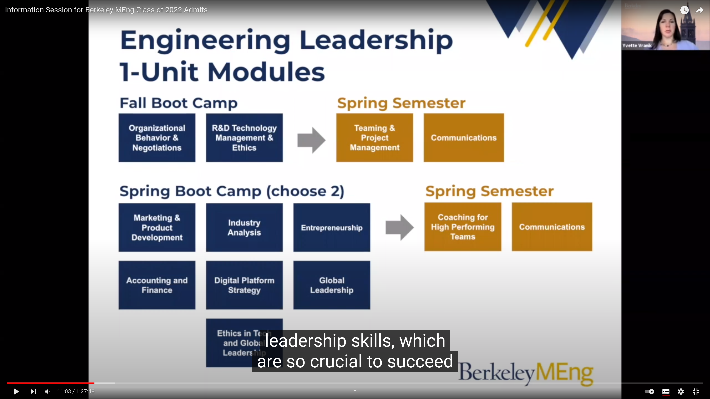

Master of Engineering (M.Eng.)
==============================

## 211115

Homepage: https://eecs.berkeley.edu/academics/graduate/industry-programs/meng

[Information Session for Berkeley MEng Class of 2022 Admits](https://www.youtube.com/watch?v=0Biqfl1Dzw4)

Funginstitute website mentioned in the info session: https://funginstitute.berkeley.edu/programs-centers/full-time-program/engineering-departments/eecs/

DDL: 220106

### workshop

总体印象：
- communication skill 和 working ethic 是被学生反复提到的两个词。
  - 我对 working ethic 也有自己的想法，可以进一步了解。
- 对于 capstone project 的说明：
  - 形式：research, commercialize some research, or make a product.
  - 特点：
    - Provide a chance to learning from experience, by doing.
    - Real life challange, can be something global (like COVID or wild fire).
    - Inclusive teaming. The world has changed and there are some new challanges like remote working.
  - university leading or partner (industry) leading.
  - 2021: You can propose your project.
    - DDL: 1 month and a half (after what?)
    - 我的一个可以做的想法：Version control for visual artists?
    - 我还想了解有没有和 \*BSD 有关的开发机会。

4 keywords to engineering leadership: innovation, inclusivity, initiative and integrity. Also can refer to ./mission.png .

Program design:

TODO: 我想要用它们做什么？选什么？

TODO: 另外申请人似乎可以在官网上向特定的学生提问？这真的是我免费可以得到的东西么？？这是真的么？？我要去找一下。

讲了很大篇幅的 network，support from school。单听这个就可以反思一下我的行事方式了（不

### Website

https://eecs.berkeley.edu/academics/graduate/industry-programs/meng

我可能感兴趣的 concentration：

Data Science and Systems: https://eecs.berkeley.edu/academics/graduate/industry-programs/meng/requirements/dss

Visual Computing and Computer Graphics: https://eecs.berkeley.edu/academics/graduate/industry-programs/meng/requirements/vccg

Capstone Projects: (不完全)
- Vision Correcting Display (advisor Prof. Brian Barsky)，在以上两个 concentration 中都有。
- 我的 Version control for visual artists 可以放在 Visual Computing and Computer Graphics。

### FAQ

https://eecs.berkeley.edu/academics/graduate/industry-programs/meng/faq

> Our Masters Student Services Advisor (see Contacts) will be happy to field any of your admissions questions.

Advisor: https://eecs.berkeley.edu/resources/grads/meng#masters-contact

For "Career changers" like me: Show requisite knowledge and skills.

> We have numerous applicants who are "career changers" and our best advice for you is to show within your application that you have the requisite knowledge and skills to succeed in this challenging program. This can include coursework, projects, industry experience, publications, letters of recommendation, and more. Succeeding in courses at UC Berkeley Extension (or another institution) could be a useful addition to your application.

