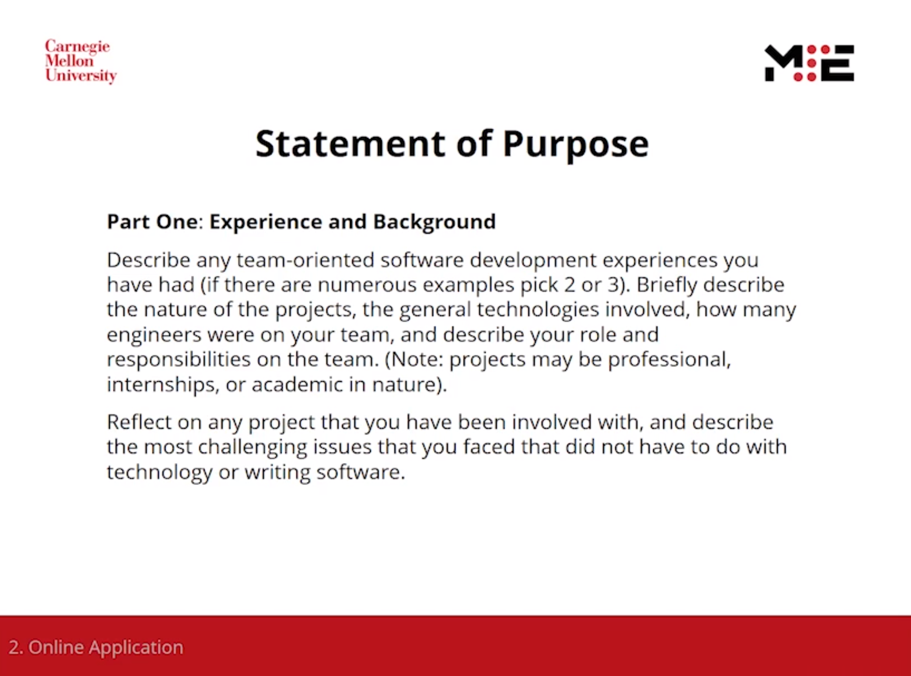
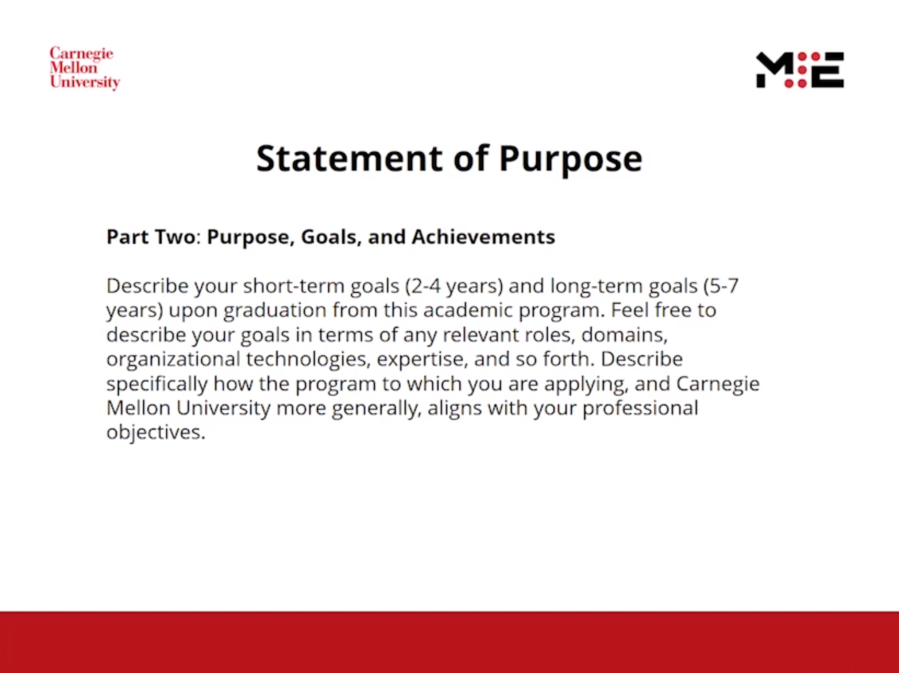
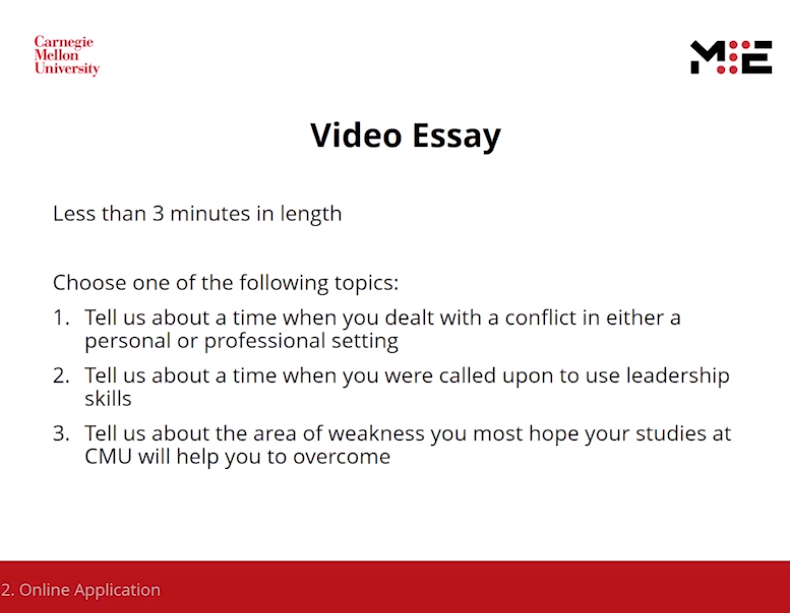

Master of Science in Computer Science
=====================================

## 211105

观看了 MSE application workshop 的视频。

2020 平均托福、GRE 都很高。今年 optional 真是太好了。

- 109 TOEFL
  - Department recommendation: total 100+ and no less than 25 each.
  - 不交也没关系，会整体上看你的材料决定。
  - 那我就很尴尬了呀，105 + verbal 20……
- 159 Verbal, 168 Quant

候选人：CS or engineer-related discipline.

----

Statement of Purpose:





1. Your connection to SE;
2. Goals(long, short term), knowledge you are missing;
  - Knowledge on specific program and CMU, aligns with your goal.
    - Focus on a few points, like curriculum, research.
  - 有一点在意的：knowledge you are missing - what you bring to the program.

1 page, single space for each section.

----

Recommendation letter:

- mentor is OK.

----

Video essay



3 optional topics, conflict, leadership or weakness.

Have fun with it. A chance. Don't be too serious.

----

Programming Assignment

- 40mins x 3.
- No stress on speed.
- How you solve task and face techinical challenges.

TODO: If you are uncertain, google "mock interview" there will be trainings XD.

----

Q&A

For non-CS applyer: Important to show you have foundation, on Data Structure or other related courses.

Voulnteering experience related to CS is welcome. Can write it into CV.
- 我刚好有。

## 211104

我的想法改变了，在看了 MSE Program Overview 的视频之后。

我开始觉得 SS 和 ES 都可以了。

- 一方面 professional 是给 mid-career 的申请者的，本身这个项目 workload is very high，我可能很难承受。
  - 同时从 overlap with undergraduate course 来看， prof 是 0%，MSCS 是 70% 左右，SS 和 ES 是 22%。加上个人的知识和努力应该后两个能够承受。
- 另一方面 SS 和 ES 也只是两个方向而已，尤其是 SS 的描述包含 data-intensive system，从我的过去经历上来看可能我会很感兴趣。
  - SS 和 ES 之间我更倾向于 SS，因为 Embedding System 的事情我也做过，感觉不是那么好找工作，而且如果不够前沿的话也很琐碎，不够酷，知识专门化程度高，迁移困难。

记录几点 MSE Program Overview 的要点：

1. 培养目标：Software Leaders, go beyond the code。
  - 所以会有 Business & Leadership Courses。
    - 就这两天写 PS 下来我期望的职业方向，这或许会对我有所帮助？
    - 原本是我把这些东西看轻了。
  - 特别强调了 communication。开源社区就是建立在 communication model 上的。
2. 期望的申请人/在 PS 中寻找的特质：
  - interested in programming
  - enough understanding of software engineering
  - can recognize issues happen in software development(doubtful, not hear it clearly.)
3. 问答环节，Professional 的小测验内容
  - 三个问题。模拟真正编程环境下会遇到的问题。
  - 会有一个 bug fixing，不像是职业面试那种算法题。
  - 一般有一个 perfomance issue。
4. 推荐信：Assume they have certain extent of ability.
5. MISC:
  - No research in MSE program.
  - The workload is very high. Manage stress. Help from CMU.
5. 一种讲求实际的气氛，毕业薪资、职位、工作地点放在 ppt 里面。

## 10 月

TL;DR: 可能不太适合我。
1. 期望有扎实的计算机基础/等同的工程经历、才能
2. 教学内容比较软性，我相对比较想学技术内容
3. 只有 Scaleable Systems 和 Embedded Systems 方向


## masters-overview-comp-data-2020-09-15

selectivity: 21%


## [Master of Software Engineering Programs](https://mse.isri.cmu.edu/index.html)

- Technology leaders
- shape and guide the industry

> We are the Master of Software Engineering Professional Programs at Carnegie Mellon University. And we are dedicated to training the next generation of technology leaders. We strive to produce some of the world's best software engineers — those who don't just deliver the next revolutionary software product but those who can, in the process, begin to shape and guide the industry itself as lifelong Agents of Change.


### MSE for Recent Grads

单看这里总有一种相当『培训班』的感觉？
> For entry-level developers with less than two years experience, or equivalent internship/project experience.

- [ ] MSE 日常都做些什么？上些什么课？
- [x] [2020 Project Overview](https://mse.isri.cmu.edu/news/2021/012221-project-thanks.html)
 
program:
- Scaleable Systems
- Embedded Systems

For B.S in CS EE or related degree.

- [ ] Is this project suitable for me?

Skill training is less, more _soft_ skill like Project Management or Architecture.

Not very flexible?

```
Semester 1-1
17-603 Communications for Software Leaders I
17-611 Statistics for Decision Making
17-612 Business & Marketing Strategy
17-614 Formal Methods
17-615 Data Structures & Algorithms

Semester 1-2
17-603 Communications for Software Leaders I
17-622 Agile Methods
17-623 Quality Assurance
17-625 Design Patterns & API Design¹
17-626 Requirements for Information Systems
```

### MSE for Professionals

for experienced software developers with at least two years of full-time professional experience

- builds on a foundation of skills and industry experience
- state-of-the-art practices used by top software engineering companies.

### [How to apply](https://mse.isri.cmu.edu/applicants/mse-as/apply.html)

可能不太适合我。
1. 期望有扎实的计算机基础/等同的工程经历、才能
2. 教学内容比较软性，我相对比较想学技术内容
3. 只有 Scaleable Systems 和 Embedded Systems 方向


> All aspects of the candidate's packet are given equal weight and consideration. No single admission criterion overshadows another; rather, it is the composite of all of the application materials that determines the admission decision.
> 
> - The ability to perform graduate-level work, 
> - a solid undergraduate background in computer science or related disciplines, 
> - software development maturity, 
> - and industry experience
> 
> are several factors considered for admission.
>
> In some cases, excellence and promise can balance a lack of formal preparation. 


